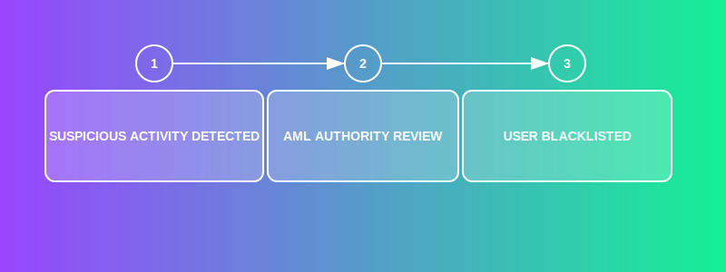

# MiCA EUR

<p align="center">
  
</p>

A regulatory-compliant EUR stablecoin implementation on Solana following the Markets in Crypto-Assets (MiCA) regulation framework.

## Overview

This project implements a fully MiCA-compliant Euro stablecoin with KYC verification, AML controls, and regulatory compliance mechanisms using Solana's SPL Token-2022 standard.

### Key Features

- **KYC Oracle** - On-chain identity verification system
- **AML Controls** - Blacklisting and suspicious activity monitoring
- **Regulatory Compliance** - Freeze/seizure capabilities for regulatory compliance
- **Reserve Verification** - On-chain proof of reserve validation

### System Architecture


## Prerequisites

- Rust nightly-2025-05-11 (specifically `rustc 1.89.0-nightly`)
- Solana CLI v1.18.17
- Anchor CLI v0.30.1
- Node.js v16+

## Quick Start

```bash
# Clone and set up
git clone https://github.com/your-org/mica_eur.git
cd mica_eur
./scripts/setup.sh

# Build
anchor build

# Run tests
npm run test:functional
```

Each component directory contains its own README.md with specific documentation for that component.

## Project Structure

```
mica_eur/
├── app/                       # Application components
│   ├── compliance-api/        # Compliance API implementation
│   └── frontend/              # Frontend application
├── docs/                      # Documentation
│   └── images/                # Diagrams and illustrations
├── kyc-api/                   # KYC API implementation
├── programs/                  # Solana programs
│   └── mica_eur/              # MiCA EUR stablecoin implementation
├── scripts/                   # Utility scripts
└── tests/                     # Test files
```

## Development

### Build

```bash
# Standard build
anchor build

# Fast build (skips linting)
npm run build:fast
```

### Testing

```bash
# Run all functional tests
npm run test:functional

# Specific test suites
npm run test:kyc           # KYC Oracle tests
npm run test:token         # Token functionality tests
npm run test:aml           # AML Authority tests
npm run test:freeze-seize  # Freeze/Seize functionality tests
```

### Deployment

```bash
anchor deploy --provider.cluster devnet
```

## Key Processes

### KYC Verification Flow

The following diagram shows how user verification works:

```mermaid
flowchart LR
    U[User Wallet] -->|POST /api/kyc/initiate| AG[API Gateway]
    AG -->|createApplicant| OA[Onfido API]
    AG -->|startWorkflow| OW[Onfido SDK]
    U -->|POST /api/kyc/verify-signature| SV[Signature Verifier]
    OA -->|webhook (check completed)| AG
    AG -->|updateKycStatus| SI[Solana Integration]
    SI -->|rpc| KO[KYC Oracle State PDA]
    SI -->|rpc| KU[KYC User PDA]
```

### AML Controls

The Anti-Money Laundering system includes blacklisting capabilities:



## Documentation

Component-specific documentation is available in each directory's README.md file.
