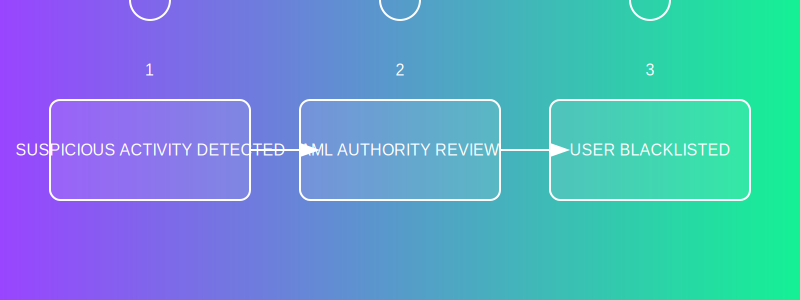
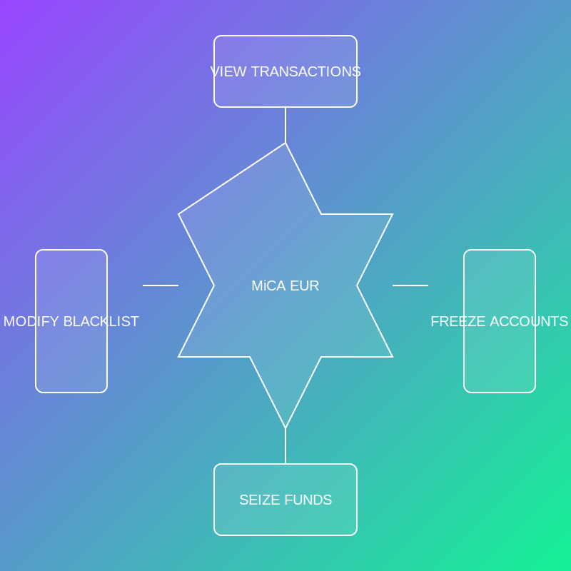

# Compliance API

Regulatory compliance API for the MiCA EUR stablecoin.

## Overview

This API implements regulatory compliance features required by the Markets in Crypto-Assets (MiCA) regulation:

- AML (Anti-Money Laundering) monitoring
- Transaction reporting
- Reserve verification
- Regulatory actions (freeze/seize)

## AML Features

### AML Architecture

The Anti-Money Laundering system includes:

1. **AML Authorities**: Entities that can enforce AML controls
2. **Blacklist Management**: Tracking of blacklisted addresses
3. **Account Freezing**: Ability to freeze suspicious accounts
4. **Token Seizure**: Capability to seize tokens when required by regulators

### AML Blacklisting Process



### AML System Overview



### AML Implementation Example

```typescript
// Register an AML authority
await program.methods
  .registerAmlAuthority(
    "EU_REGULATOR_001",  // Authority ID
    7                    // Powers (bitmask: freeze=1, seize=2, blacklist=4)
  )
  .accounts({
    authority: regulatorWallet.publicKey,
    amlAuthority: amlAuthorityPda,
    systemProgram: SystemProgram.programId,
  })
  .signers([regulatorWallet])
  .rpc();

// Create blacklist entry
await program.methods
  .createBlacklistEntry(
    1  // Reason code (1=fraud, 2=money laundering, etc.)
  )
  .accounts({
    authority: regulatorWallet.publicKey,
    amlAuthority: amlAuthorityPda,
    user: suspiciousUser.publicKey,
    blacklistEntry: blacklistEntryPda,
    systemProgram: SystemProgram.programId,
  })
  .signers([regulatorWallet])
  .rpc();
```

## Setup

1. Install dependencies:
   ```bash
   npm install
   ```

2. Configure environment variables:
   ```bash
   cp .env.example .env
   ```

3. Setup database (if needed):
   ```bash
   npm run db:setup
   ```

## Usage

### Start the Compliance API

```bash
npm start
```

### Development Mode

```bash
npm run dev
```

### Testing

```bash
npm test
```

## Features

### AML Monitoring

- Suspicious transaction detection
- Real-time transaction screening
- Alert generation for compliance review

### Regulatory Reporting

- Transaction reporting endpoints for regulators
- Aggregate metrics generation
- Compliance documentation

### Reserve Verification

- Reserve proof generation
- Merkle tree proof creation
- Reserve reconciliation 