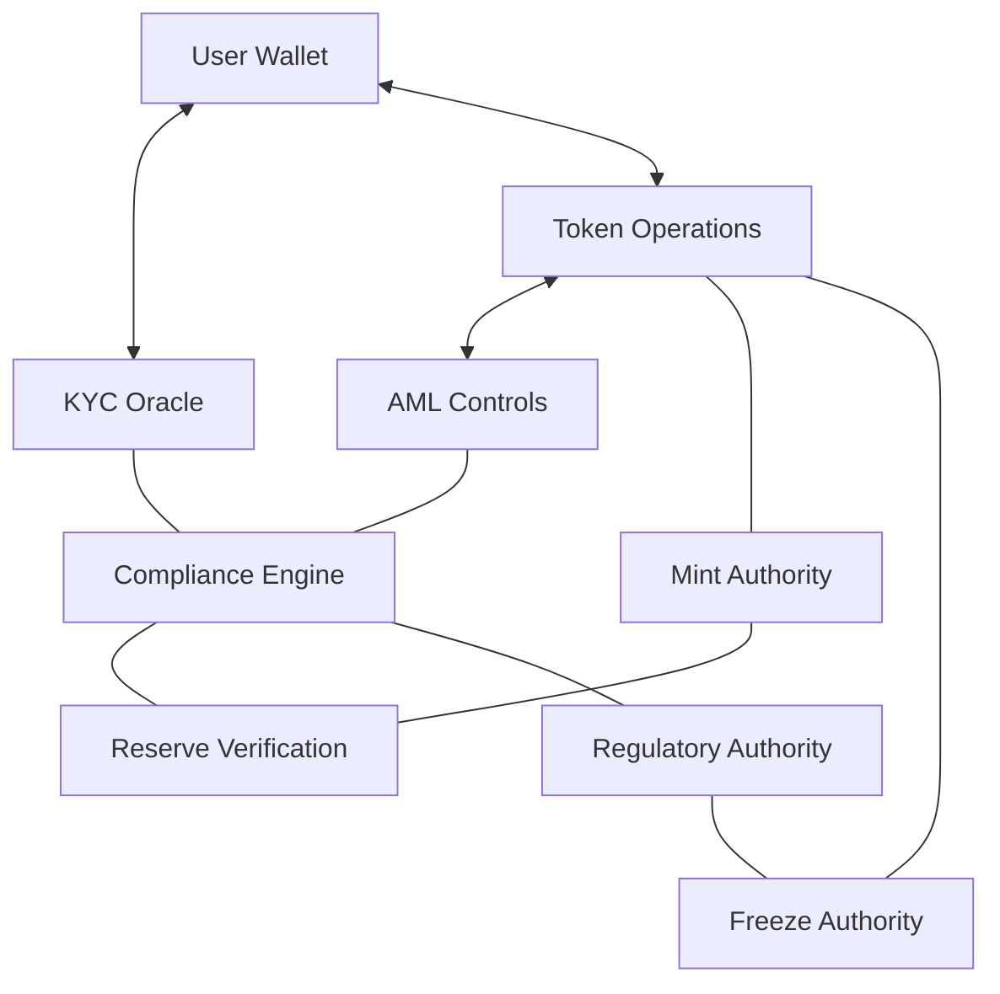
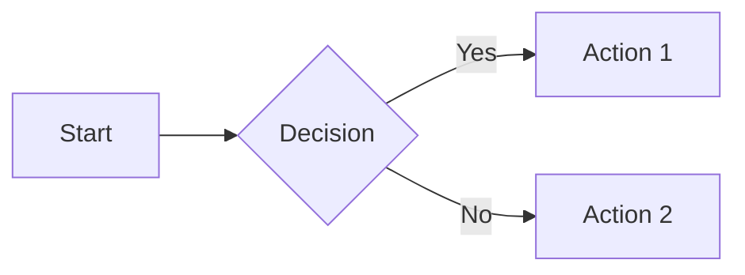

# MiCA EUR Documentation

This document provides comprehensive documentation for the MiCA EUR stablecoin implementation.

> **Note:** Much of this documentation has been redistributed to component-specific README.md files in their respective directories. This document remains as a central reference but you can also find detailed documentation in:
> - [programs/mica_eur/README.md](../programs/mica_eur/README.md) - Core program implementation details
> - [kyc-api/README.md](../kyc-api/README.md) - KYC system documentation
> - [app/compliance-api/README.md](../app/compliance-api/README.md) - AML and compliance information
> - [app/frontend/README.md](../app/frontend/README.md) - Frontend application documentation
> - [scripts/README.md](../scripts/README.md) - Build and utility scripts documentation
> - [tests/README.md](../tests/README.md) - Testing information and guides

## Table of Contents

- [Build Configuration](#build-configuration)
- [Project Architecture](#project-architecture)
- [KYC System](#kyc-system)
- [AML Features](#aml-features)
- [Whitepaper](#whitepaper)
- [Diagrams and Flowcharts](#diagrams-and-flowcharts)

## Build Configuration

### Required Toolchain

The project uses a specific Rust toolchain:
```
rustc 1.89.0-nightly (ce7e97f73 2025-05-11)
cargo 1.89.0-nightly (056f5f4f3 2025-05-09)
```

This is configured in `rust-toolchain.toml`:
```toml
[toolchain]
channel = "nightly-2025-05-11" 
components = ["rustfmt", "clippy"]
targets = ["bpfel-unknown-none"]
profile = "minimal"
```

### Dependency Requirements

To resolve build issues, specific dependencies must be pinned:

In `Anchor.toml`:
```toml
[dependencies]
proc-macro2 = "=1.0.94"
```

### Common Build Issues and Fixes

1. **Missing `lib.rs` in Project Root**

   Anchor looks for a `lib.rs` file in the project root directory, while the actual program code is in `programs/mica_eur/src/lib.rs`.

   **Solution**: The build script automatically creates a stub `lib.rs` file in the project root.

2. **Multiple Versions of Borsh**

   **Solution**: Pin the `borsh` version in `Cargo.toml` to `0.10.4`.

3. **Incorrect Cargo.lock Version**

   **Solution**: Ensure Cargo.lock is at version 3.

### Troubleshooting

If you encounter build issues:

1. Check the Rust toolchain:
   ```bash
   rustup override set nightly-2025-05-11
   ```

2. Verify dependency versions in Anchor.toml

3. Clean and rebuild:
   ```bash
   rm -rf target/deploy
   rm -rf .anchor
   ./scripts/build.sh --clean
   ```

## Project Architecture

The MiCA EUR stablecoin implements a regulatory-compliant EUR stablecoin with the following components:

### Core Components

1. **KYC Oracle**: Manages user verification status
2. **AML Controls**: Implements Anti-Money Laundering functionality
3. **Token Management**: Controls minting, burning, and transfers
4. **Compliance Engine**: Enforces regulatory requirements

### System Architecture Diagram

The following diagram illustrates the high-level architecture of the MiCA EUR system:



### Token Implementation

The token uses Solana's SPL Token-2022 program with the following extensions:

- **DefaultAccountState**: Token accounts are frozen by default
- **TransferHook**: Validates transfers against KYC requirements
- **PermanentDelegate**: Allows regulatory seizing of tokens
- **MetadataPointer**: Links to the token's whitepaper

## KYC System

### KYC Flow Overview

The MiCA EUR stablecoin implements a comprehensive KYC flow:

1. **KYC Oracle Initialization**: Setting up the centralized authority
2. **User Registration**: Registering users in the KYC system
3. **KYC Verification**: Updating user status and verification level
4. **Account Creation**: Creating token accounts (initially frozen)
5. **Account Thawing**: Thawing accounts for KYC-verified users
6. **Token Operations**: Minting, transferring, and burning tokens based on KYC status

### KYC Flow Diagram

The following diagram illustrates the KYC verification flow:

```mermaid
flowchart LR
    U[User Wallet] -->|POST /api/kyc/initiate| AG[API Gateway]
    AG -->|createApplicant| OA[Onfido API]
    AG -->|startWorkflow| OW[Onfido SDK]
    U -->|POST /api/kyc/verify-signature| SV[Signature Verifier]
    OA -->|webhook (check completed)| AG
    AG -->|updateKycStatus| SI[Solana Integration]
    SI -->|rpc| KO[KYC Oracle State PDA]
    SI -->|rpc| KU[KYC User PDA]
```

### Verification Levels

- **Unverified (Level 0)**: Can transfer tokens, but cannot mint or redeem
- **Basic (Level 1)**: Individual users with verified bank accounts, can mint and redeem
- **Standard (Level 2)**: Business users with additional compliance checks, higher limits
- **Advanced (Level 3)**: Institutional users with comprehensive checks, highest limits

### KYC Implementation Example

```typescript
// Initialize KYC Oracle
await program.methods
  .initializeKycOracle()
  .accounts({
    authority: kycAuthority.publicKey,
    kycOracleState: kycOracleStatePda,
    systemProgram: SystemProgram.programId,
    rent: SYSVAR_RENT_PUBKEY,
  })
  .signers([kycAuthority])
  .rpc();

// Register a user for KYC
await program.methods
  .registerKycUser(
    "10070000", // BLZ (German bank code)
    ibanHash,   // SHA-256 hash of the IBAN
    "DE",       // Country code
    "veriff"    // Verification provider
  )
  .accounts({
    authority: kycAuthority.publicKey,
    kycOracleState: kycOracleStatePda,
    user: userWallet.publicKey,
    kycUser: kycUserPda,
    systemProgram: SystemProgram.programId,
    rent: SYSVAR_RENT_PUBKEY,
  })
  .signers([kycAuthority])
  .rpc();

// Update KYC status
await program.methods
  .updateKycStatus(
    { verified: {} }, // KYC status enum
    1,                // Verification level (Basic)
    365               // Expiry days (1 year)
  )
  .accounts({
    authority: kycAuthority.publicKey,
    kycOracleState: kycOracleStatePda,
    kycUser: kycUserPda,
  })
  .signers([kycAuthority])
  .rpc();
```

## AML Features

### AML Architecture

The Anti-Money Laundering system includes:

1. **AML Authorities**: Entities that can enforce AML controls
2. **Blacklist Management**: Tracking of blacklisted addresses
3. **Account Freezing**: Ability to freeze suspicious accounts
4. **Token Seizure**: Capability to seize tokens when required by regulators

### AML Blacklisting Process Diagram


### AML System Overview


### AML Implementation Example

```typescript
// Register an AML authority
await program.methods
  .registerAmlAuthority(
    "EU_REGULATOR_001",  // Authority ID
    7                    // Powers (bitmask: freeze=1, seize=2, blacklist=4)
  )
  .accounts({
    authority: regulatorWallet.publicKey,
    amlAuthority: amlAuthorityPda,
    systemProgram: SystemProgram.programId,
  })
  .signers([regulatorWallet])
  .rpc();

// Create blacklist entry
await program.methods
  .createBlacklistEntry(
    1  // Reason code (1=fraud, 2=money laundering, etc.)
  )
  .accounts({
    authority: regulatorWallet.publicKey,
    amlAuthority: amlAuthorityPda,
    user: suspiciousUser.publicKey,
    blacklistEntry: blacklistEntryPda,
    systemProgram: SystemProgram.programId,
  })
  .signers([regulatorWallet])
  .rpc();

// Freeze an account
await program.methods
  .freezeAccount()
  .accounts({
    freezeAuthority: freezeAuthority.publicKey,
    mintInfo: mintInfoPda,
    mint: mintKeypair.publicKey,
    tokenAccount: suspiciousAccount,
    tokenProgram: TOKEN_2022_PROGRAM_ID,
  })
  .signers([freezeAuthority])
  .rpc();
```

## Whitepaper

### Executive Summary

MiCA EUR is a digital representation of the Euro on the Solana blockchain, fully backed 1:1 by Euro deposits held in regulated European financial institutions. It combines blockchain efficiency with Euro stability and regulatory compliance.

### Token Design

- **Token Standard**: SPL Token-2022
- **Decimals**: 9 (allowing fractional tokens down to 0.000000001 EUR)
- **Extensions**: DefaultAccountState, TransferHook, PermanentDelegate, MetadataPointer

### Reserve Assets

MiCA EUR is backed 1:1 by Euro reserves held in regulated EU financial institutions:
- **85%**: Cash deposits in multiple systemic European banks
- **15%**: Short-term (< 90 days) European government securities

### Issuance and Redemption

1. **Issuance Process**:
   - User completes KYC
   - User transfers Euros via SEPA
   - Tokens are minted after bank confirmation
   - Daily reconciliation ensures reserve matches supply

2. **Redemption Process**:
   - User submits redemption request
   - After compliance checks, Euros are sent to verified bank account
   - Tokens are permanently burned

### Compliance Framework

The token implements MiCA compliance through:
- KYC/AML verification
- Account freezing capabilities
- Token seizure for regulatory enforcement
- 1:1 backing with transparent reserve proof
- Daily proof-of-reserve verification

## Client Integration

To integrate with a client application:

```typescript
import { Program } from '@coral-xyz/anchor';
import { Connection, PublicKey } from '@solana/web3.js';
import { MicaEur } from '../target/types/mica_eur';
import idl from '../target/idl/mica_eur.json';

// Initialize the program
const programId = new PublicKey('your_program_id_here');
const program = new Program(idl, programId) as Program<MicaEur>;

// Call program instructions
const tx = await program.methods
  .registerKycUser(userInfo)
  .accounts({
    // required accounts
  })
  .rpc();
```

## Diagrams and Flowcharts

The project includes several diagrams and flowcharts to illustrate key components and processes:

### Available Diagrams

1. **System Architecture Diagram** - Illustrates the high-level architecture of the MiCA EUR system
2. **KYC Flow Diagram** - Shows the KYC verification process
3. **AML Blacklisting Process** - Illustrates how accounts are blacklisted
4. **MiCA EUR AML System** - Overview of the AML system architecture

### Mermaid Diagrams

The documentation uses Mermaid syntax for creating flowcharts. These diagrams are rendered directly in GitHub and other Markdown viewers that support Mermaid.

Example of creating a Mermaid diagram:



### SVG Diagrams

SVG diagrams are stored in the `docs/images/` directory and can be referenced using standard Markdown image syntax:
