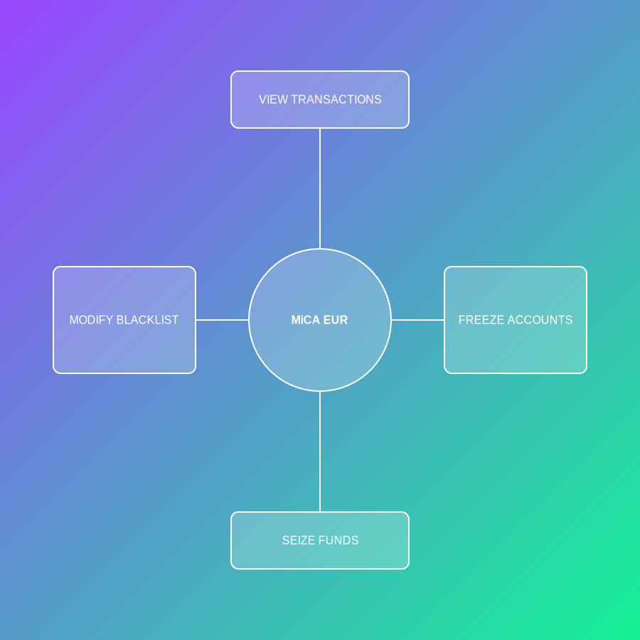

# MiCA EUR AML Feature Documentation

## Overview

The MiCA EUR stablecoin program implements robust Anti-Money Laundering (AML) controls, enabling external regulatory authorities to:

- Register as AML authorities with specific powers
- Flag and blacklist suspicious users
- Deactivate (un-blacklist) users
- Update their own regulatory powers
- Be deactivated by the issuer/regulator

This system ensures compliance with MiCA and other regulatory frameworks, providing on-chain enforcement and auditability.

---

## AML Account Structures

### 1. `AmlAuthority` Account

| Field             | Type      | Description                                      |
|-------------------|-----------|--------------------------------------------------|
| authority         | Pubkey    | AML authority's wallet address                   |
| authority_id      | String    | External identifier (e.g., LEI, registration #)  |
| powers            | u8        | Bitfield of granted powers                       |
| is_active         | bool      | Whether the authority is active                  |
| creation_time     | i64       | Unix timestamp of creation                       |
| last_action_time  | i64       | Last time an AML action was performed            |

**Powers Bitfield:**
- `VIEW_TRANSACTIONS`
- `FREEZE_ACCOUNTS`
- `SEIZE_FUNDS`
- `MODIFY_BLACKLIST`

### 2. `BlacklistEntry` Account

| Field         | Type      | Description                        |
|---------------|-----------|------------------------------------|
| user          | Pubkey    | Blacklisted user's wallet address  |
| authority     | Pubkey    | AML authority who blacklisted user |
| reason        | u8        | Reason code for blacklisting       |
| is_active     | bool      | Whether the blacklist is active    |
| creation_time | i64       | Unix timestamp of creation         |

---

## AML Instruction Flows

### 1. Register AML Authority

**Actors:** Issuer/Regulator  
**Flow:**
1. Issuer calls `register_aml_authority` with authority's pubkey, ID, and powers.
2. Program creates a new `AmlAuthority` account (PDA).
3. Authority is now able to perform AML actions as per their powers.

**Flowchart:**

---

### 2. Blacklist a User

**Actors:** AML Authority  
**Flow:**
1. AML authority calls `create_blacklist_entry` with user pubkey and reason.
2. Program checks authority's powers and active status.
3. If valid, creates a `BlacklistEntry` account (PDA) for the user.

**Flowchart:**

---

### 3. Deactivate (Un-blacklist) a User

**Actors:** AML Authority  
**Flow:**
1. AML authority calls `deactivate_blacklist_entry` for a user.
2. Program checks authority's powers and active status.
3. If valid, sets `is_active` to false on the `BlacklistEntry`.

**Flowchart:**

---

### 4. Deactivate AML Authority

**Actors:** Issuer/Regulator  
**Flow:**
1. Issuer calls `deactivate_aml_authority` for an authority.
2. Program sets `is_active` to false on the `AmlAuthority` account.

**Flowchart:**

---

### 5. Update AML Authority Powers

**Actors:** Issuer/Regulator  
**Flow:**
1. Issuer calls `update_aml_authority_powers` with new powers.
2. Program updates the `powers` field on the `AmlAuthority` account.

**Flowchart:**

---

## Security & Compliance

- **Authority Checks:** All AML actions require authority signature and power validation.
- **Auditability:** All actions are on-chain, timestamped, and linked to authority accounts.
- **Revocation:** Authorities and blacklist entries can be deactivated, supporting dynamic compliance.
- **Extensibility:** New powers and reason codes can be added as needed.

---

## Example: Blacklisting and Un-blacklisting a User

---

## Integration Points

- **Client SDK:** Expose all AML instructions via Anchor IDL for easy integration.
- **UI:** Provide admin panels for issuer/regulator and AML authorities to manage users and powers.
- **Monitoring:** On-chain events can be indexed for compliance dashboards.

---

## Summary Table

| Instruction                  | Who Can Call         | What It Does                                 |
|------------------------------|----------------------|-----------------------------------------------|
| register_aml_authority       | Issuer/Regulator     | Registers a new AML authority                 |
| create_blacklist_entry       | AML Authority        | Blacklists a user                             |
| deactivate_blacklist_entry   | AML Authority        | Un-blacklists a user                          |
| deactivate_aml_authority     | Issuer/Regulator     | Deactivates an AML authority                  |
| update_aml_authority_powers  | Issuer/Regulator     | Updates powers of an AML authority            |

---

## Final Notes

- The AML system is modular, secure, and fully auditable.
- All flows are covered by automated tests.
- The design supports regulatory compliance and future extensibility. 